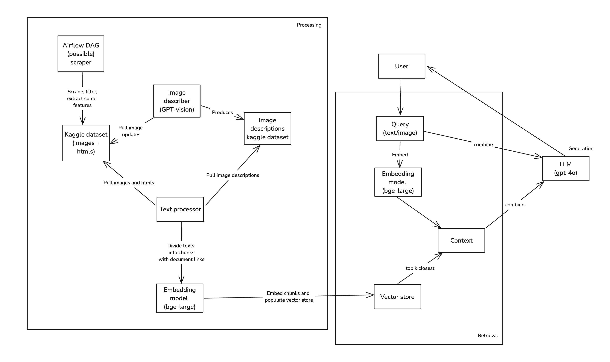
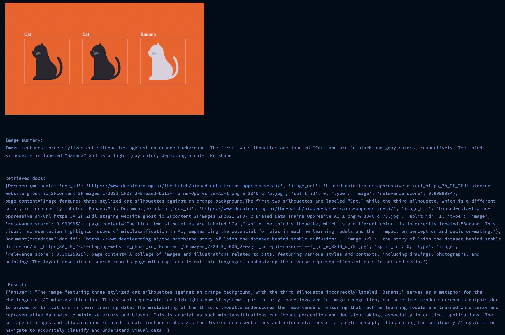
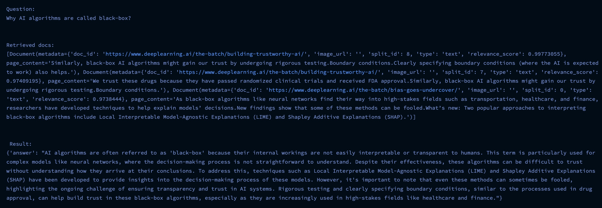

# Multimodal RAG on "The Batch" atricles

## **Live Streamlit demo link: [https://the-batch-rag.streamlit.app/](https://the-batch-rag.streamlit.app/)**
Also streamlit demo code could be found in the following repo [https://github.com/Houstoten/the-batch-rag](https://github.com/Houstoten/the-batch-rag)

### Run the following snippet to setup virtual env and run the app

Before start you have to define `.env` in the project root. Check `.env.example` for the reference.
**Run with flag `USE_PRELOADED_VECTOR_STORE=True` to avoid dataset and vector store construction. This will pull prebuilt one.**

```bash
uv sync --frozen
uv run run.py
```

This will load all dependencies, models and datasets and open streamlit webapp for inference.

To build and run docker image run the following:

```bash
docker build -t mm_rag:v4 .
docker run --env-file ./.env -p 8501:8501  mm_rag:v4
```

## High-level architecture



In this implementation I used `gpt-4o` to describe images, for then to be embedded and added to the single vector space.
I decided to go this way, as I considered it more efficient, than using `CLIP` embedding model on texts and images combined, or even having 2 separate vector spaces for images and texts, for then to algorithmically combine retrieved results.

## Scraping

Here I utilized sitemap to find all the links, and picked ones that satisfy perdictor.
I simply parsed `<article>` tags with some specific classes, so results are without headers, footers etc. Then I filtered inconsistent entries by missing article `Title` or `Publication date`. Here the flow could be adjusted to avoid omitting relevant articles.
I suggest, for this flow, it's possible to run Airflow DAG, comparing sets of present and all articles from sitemap.

Look [app/modules/scraper/article_scraper.py](app/modules/scraper/article_scraper.py)

## Data transformations

From scraped articles and images I manually created kaggle dataset. Look [https://www.kaggle.com/datasets/ivanhusarov/the-batch-articles-initial](https://www.kaggle.com/datasets/ivanhusarov/the-batch-articles-initial)

### For images 

Images required descriptions, so I used `gpt-4o` model to describe each. I also added article context to the query, so image descriptions were more related. Look [app/modules/image_processor/image_describer.py](app/modules/image_processor/image_describer.py). 
Here code checks the difference in image/article dataset and already generated descriptions. As a result, this part of code updates another image descriptions dataset. Look [https://www.kaggle.com/code/ivanhusarov/preprocess-image-descriptions](https://www.kaggle.com/code/ivanhusarov/preprocess-image-descriptions).

### For articles

Articles required only text extraction from `html` structure, it was done with `bs4`.

## Chunking and embedding

Both image descriptions and texts are from now processed the same. The only difference, is that for images additional metadata fields are added: `image_url` and `is_image`.
For chunking technique I decided to use `by-sentence` chunking with `2` sentences in each chunk, with `1` overlapping for each chunk in a document. 
As embedding model, I decided to use `BAAI/bge-large-en-v1.5`, as it gives relatively good performance, one could even said, that it performs almost the same with `OpenAI` embeddings.
For this part and all below, look [app/pipelines/workflow.py](app/pipelines/workflow.py)

## Adding to vector store and generating retriever

As a framework for RAG I decided to use `LangChain`, and as a vector store, I used `ChromaDB`.
After vector store was populated and retriever was generated, I decided to utilize `Cohere reranker` for better results

## Prompt

Prompt itself looks like this. It incorporates multimodal capabilities via inputs and instructions.

```python
rag_prompt = """You are an advanced retrieval and generation assistant, trained to provide **detailed, accurate, and contextually relevant answers**. Leverage the provided **context**, user inputs, and embedded memory to construct logically sound and comprehensive responses.

### Task:
1. **Understand the Query**: Analyze user inputs to discern intent and determine the best retrieval and synthesis strategy.
2. **Employ Chain of Thought (CoT)**: Break down reasoning step by step to ensure depth, accuracy, and coherence in the response.
3. **Leverage Context**: Integrate contextual information with retrieved knowledge to ensure the answer aligns with the user's requirements.
4. **Generate Outputs Dynamically**: Tailor the response to the input format (text, image description, or both).

### Input Schema:
- **Context**: {context}
- **Text Input**: {text_input} (optional)
- **Image Description**: {image_description} (optional)

### Instructions by Scenario:
1. **Only Text Provided**:
   - Focus exclusively on the text input.
   - Extract key details from the context to complement the analysis.
2. **Only Image Description Provided**:
   - Analyze the described image thoroughly.
   - Use the context to enhance the interpretation of the visual elements.
3. **Both Text and Image Description Provided**:
   - Synthesize information from both inputs for a cohesive and nuanced response.

### Chain of Thought (CoT) Reasoning:
- **Step 1**: Analyze all inputs to determine the user’s intent.
- **Step 2**: Identify the required knowledge domains and retrieve relevant information.
- **Step 3**: Verify the sufficiency of retrieved information against the context and inputs.
- **Step 4**: Formulate a detailed, coherent, and accurate response.

### Final Response:
- Structure: Ensure the output is clear, precise, and aligned with user intent.
- Depth: Provide additional insights or actionable recommendations where appropriate.
- Clarity: Avoid unnecessary jargon while maintaining technical accuracy.

---

### Example Queries for Different Scenarios

#### **Scenario 1: User Inputs Only Text**
**Context**: Recent advancements in quantum computing.
**Text Input**: "Explain the impact of qubits on computational speed."
**Response**: (Use CoT reasoning to address the question in depth, referencing the context on quantum computing.)

#### **Scenario 2: User Inputs Only Image Description**
**Context**: Environmental conservation initiatives.
**Image Description**: "A detailed image of a river surrounded by deforested land."
**Response**: (Analyze the environmental implications using the context and interpret the visual information.)

#### **Scenario 3: User Inputs Both Text and Image Description**
**Context**: Climate change and renewable energy.
**Text Input**: "What are the benefits of solar panels in urban areas?"
**Image Description**: "An image of a rooftop covered with solar panels."
**Response**: (Synthesize both inputs to create a comprehensive answer about urban solar panel benefits.)

---

Return your response as a JSON object with the following structure:
{{
    "answer": an answer from the context.
}}

Always return your response as a JSON object.
"""
```

## Context generation and QA

As LLM for QA, `gpt4-o` is used here. After context is generated from retrieved results, specific QA prompt is populated with question and context.
Image descriptions are generated with same `gpt4-o` and added to the query as a context.

## Evaluation

### Prompt evaluation
**Look [Multimodal RAG evaluation.ipynb](Multimodal RAG evaluation.ipynb) for more tests.**
I generated synthetic dataset to evaluate prompt, using `F1-score` metric. Processed on `20` generated QA pairs, I got `f1 = 0.755`. 

### Multimodal query evaluation

I picked one from the tests I performed in notebook mentioned above. As we can see, retriever easily finds the document, and the answer is clearly augmented with document context.



### Text query evaluation 

Here I also picked one from the tests I performed in notebook mentioned above. For text-only queries, result is even more clear, as less uncertainty is added via additional image query.



It's important to admit, that on the retrieval time, image is described with same LLM `gpt4-o`, but without any document context, so this step in someway prevents `"overfitting"`.

## Evaluation on synthetic dataset

I also tried to generate some evaluation pipeline with `RAGAS`. I'm not sure about it's actual accuracy, since questions, answers and contexts were all generated with special prompts, so results are not stable.


## Links

[https://the-batch-rag.streamlit.app/](https://the-batch-rag.streamlit.app/)

[https://github.com/Houstoten/the-batch-rag](https://github.com/Houstoten/the-batch-rag)

[https://www.kaggle.com/code/ivanhusarov/the-batch-articles-multimodal-rag](https://www.kaggle.com/code/ivanhusarov/the-batch-articles-multimodal-rag)

[https://www.kaggle.com/code/ivanhusarov/preprocess-image-descriptions](https://www.kaggle.com/code/ivanhusarov/preprocess-image-descriptions)

[https://www.kaggle.com/datasets/ivanhusarov/the-batch-articles-initial](https://www.kaggle.com/datasets/ivanhusarov/the-batch-articles-initial)

[https://www.kaggle.com/datasets/ivanhusarov/the-batch-articles-image-descriptions](https://www.kaggle.com/datasets/ivanhusarov/the-batch-articles-image-descriptions)
