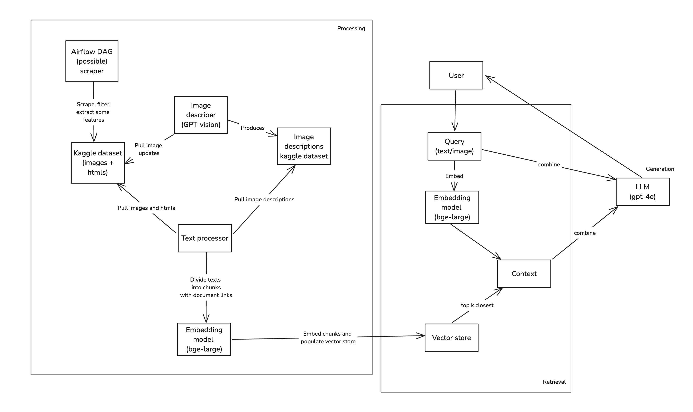
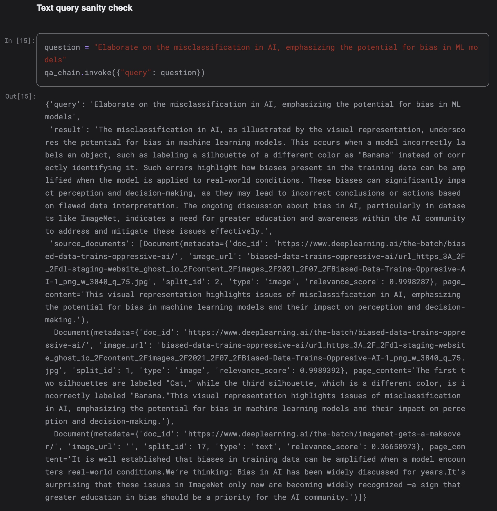
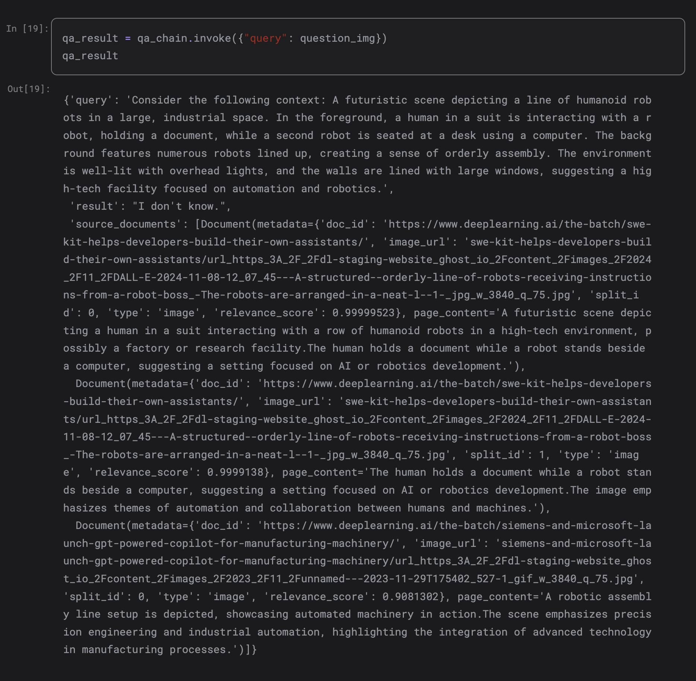

# Multimodal RAG on "The Batch" atricles

## **Live Streamlit demo link: [https://the-batch-rag.streamlit.app/](https://the-batch-rag.streamlit.app/)**
Also streamlit demo code could be found in the following repo [https://github.com/Houstoten/the-batch-rag](https://github.com/Houstoten/the-batch-rag)

### Run the following snippet to setup virtual env

```bash
conda create --name <env_name> --file requirements.txt
```

## High-level architecture



In this implementation I used `gpt-4o` to describe images, for then to be embedded and added to the single vector space.
I decided to go this way, as I considered it more efficient, than using `CLIP` embedding model on texts and images combined, or even having 2 separate vector spaces for images and texts, for then to algorithmically combine retrieved results.

## Scraping

Here I utilized sitemap to find all the links, and picked ones that satisfy perdictor.
I simply parsed `<article>` tags with some specific classes, so results are without headers, footers etc. Then I filtered inconsistent entries by missing article `Title` or `Publication date`. Here the flow could be adjusted to avoid omitting relevant articles.
I suggest, for this flow, it's possible to run Airflow DAG, comparing sets of present and all articles from sitemap.

Look [fetch_articles.ipynb](fetch_articles.ipynb)

## Data transformations

From scraped articles and images I manually created kaggle dataset. Look [https://www.kaggle.com/datasets/ivanhusarov/the-batch-articles-initial](https://www.kaggle.com/datasets/ivanhusarov/the-batch-articles-initial)

### For images 

Images required descriptions, so I used `gpt-4o` model to describe each. I also added article context to the query, so image descriptions were more related. Look [https://www.kaggle.com/code/ivanhusarov/preprocess-image-descriptions](https://www.kaggle.com/code/ivanhusarov/preprocess-image-descriptions). 
In this notebook I checked difference in image/article dataset and already generated descriptions. As a result, this notebook updates image another descriptions dataset. Look [https://www.kaggle.com/code/ivanhusarov/preprocess-image-descriptions](https://www.kaggle.com/code/ivanhusarov/preprocess-image-descriptions).

### For articles

Articles required only text extraction from `html` structure, it was done with `bs4`.

## Chunking and embedding

Both image descriptions and texts are from now processed the same. The only difference, is that for images additional metadata fields are added: `image_url` and `is_image`.
For chunking technique I decided to use `by-sentence` chunking with `2` sentences in each chunk, with `1` overlapping for each chunk in a document. 
As embedding model, I decided to use `BAAI/bge-large-en-v1.5`, as it gives relatively good performance, one could even said, that it performs almost the same with `OpenAI` embeddings.
For this part and all below, look [https://www.kaggle.com/code/ivanhusarov/the-batch-articles-multimodal-rag](https://www.kaggle.com/code/ivanhusarov/the-batch-articles-multimodal-rag)

## Adding to vector store and generating retriever

As a framework for RAG I decided to use `LangChain`, and as a vector store, I used `ChromaDB`.
After vector store was populated and retriever was generated, I decided to utilize `Cohere reranker` for better results

## Context generation and QA

As LLM for QA, `gpt4-o` is used here. After context is generated from retrieved results, specific QA prompt is populated with question and context.
Image descriptions are generated with same `gpt4-o` and added to the query as a context.

## Evaluation

### Text query evaluation

For text results are great, `0.99` similarity score for the vaguely defined query. LLM also generated response nicely


### Text query evaluation 

For images results are also good enough. LLM returned `I don't know` as a result, however relevant document was found with `0.99` similarity score. Here's first image is query image.


And now results.


It's important to admit, that on the retrieval time, image is described with same LLM `gpt4-o`, but without any document context, so this step in someway prevents `"overfitting"`.

## Evaluation on synthetic dataset

I also tried to generate some evaluation pipeline with `RAGAS`. I'm not sure about it's actual accuracy, since questions, answers and contexts were all generated with special prompts, so results are not stable.


## Links

[https://the-batch-rag.streamlit.app/](https://the-batch-rag.streamlit.app/)

[https://github.com/Houstoten/the-batch-rag](https://github.com/Houstoten/the-batch-rag)

[https://www.kaggle.com/code/ivanhusarov/the-batch-articles-multimodal-rag](https://www.kaggle.com/code/ivanhusarov/the-batch-articles-multimodal-rag)

[https://www.kaggle.com/code/ivanhusarov/preprocess-image-descriptions](https://www.kaggle.com/code/ivanhusarov/preprocess-image-descriptions)

[https://www.kaggle.com/datasets/ivanhusarov/the-batch-articles-initial](https://www.kaggle.com/datasets/ivanhusarov/the-batch-articles-initial)

[https://www.kaggle.com/code/ivanhusarov/preprocess-image-descriptions](https://www.kaggle.com/code/ivanhusarov/preprocess-image-descriptions)

